  <h1>Hi there, I'm Gourabananda Datta 👋</h1>

  

  

    Student at <b>Ramkrishna Mahato Government Engineering College</b>
  

  

    
    
    
  

  
  

 

---

### 👨‍💻 About Me

I am a Computer Science and Engineering student passionate about solving complex problems. My focus bridges the gap between **low-level systems** (Operating Systems, Compilers) and **high-level intelligence** (Machine Learning, Computer Vision).

- 🔭 I’m currently working on **MLOps pipelines and OCR models**.
- 🌱 I’m currently deepening my knowledge in **Compiler Design** and **Node.js**.

---

### 🛠️ Technical Stack

| **Domain** | **Technologies** |
| :--- | :--- |
| **Languages** |    |
| **AI & Data** |     |
| **Cloud & DevOps** |     |
| **Backend & DB** |     |

---

### 🚀 Featured Projects

- **OCR & Table Extraction**: Implemented OCR models like `pix2table` for high-precision text and table extraction from images.
- **pyfastmath**: A custom Python library optimized for high-performance mathematical computations.
- **BERT Intent Classifier**: An NLP model fine-tuned on BERT architecture to classify user intent for conversational AI.
- **Loan Default Classification**: A machine learning model designed to predict loan defaults based on financial data analysis.

---

### 📊 GitHub Stats

  
  

 

  

---

### 🤝 Connect with me

